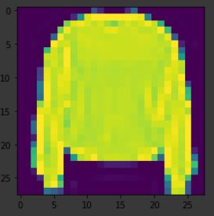
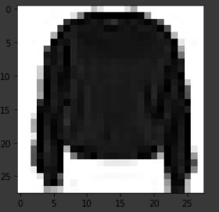

<!-- Tensorflow basics -->

### What is tensoflow?

_TensorFlow is a free and open-source software library for dataflow and differentiable programming across a range of tasks. It is a symbolic math library, and is also used for machine learning applications such as neural networks._

We're going to use **keras**. Let's see what is this?

- **Keras** is a neural network library while **Tensorflow** is the open source library for a number of various tasks in machine learning.
- **Tensorflow** provides both high-level and low-level APIs while **Keras** provides only high-level APIs

This definitions are taken from google and official documentation of tensorflow. We'll follow the [official documentation](https://www.tensorflow.org/guide/keras "Learn keras") which is the best resource to learn tensorflow.

Let's not think much about this, we'll learn by practising things.

---

We're gonna use [Google Colab](https://colab.research.google.com/ "similar to Jupyter Notebook") for this tutorial. It is a free cloud service that requires no setup to use.

Let's install it first.

> `!pip install tensorflow`

1. Now import the followings:

```python
import tensorflow as tf
from tensorflow import keras
import numpy as np
import matplotlib.pyplot as plt
```

2. We need some data to work with. There is a dataset called [Fashion-MNIST](https://research.zalando.com/welcome/mission/research-projects/fashion-mnist/) which is inside keras and we'll use it in this tutorial. There are bunch of datasets to work with. Now let's load this data.

> `data = keras.datasets.fashion_mnist`

_It consists of -_

- _70k images_
- _10 categories_
- _The images are in grayscale (means the amount of information is reduced) having pixel values 28\*28. less pixel value means less time for computer to do processing_

3. We need to split out data into traing data and test data.
   - First we'll train the data
   - Then we'll use test data to evaluate how accurate is the training.

> `(train_images, train_labels), (test_images, test_labels) = data.load_data()`

- _The images are 28x28 NumPy arrays, with pixel values ranging from 0 to 255._
- _The labels are an array of integers, ranging from 0 to 9._


4. The result will be shown a value ranging between 0 to 9. As we don't know which label means what item, we can write the following code to store the label descriptions. I'm copying the code from [documnetation](https://www.tensorflow.org/tutorials/keras/classification).

   - We can do bunch of things with this data

   ```python
   print(len(train_images), len(test_images))
   print(train_images.shape, test_images.shape)
   ```

   The output will be like this:

   ```
    60000 10000
    (60000, 28, 28) (10000, 28, 28)
   ```

   - We can visualize the data using pyplot by writing this code

   ```
   plt.imshow(train_images[7], cmap=plt.cm.binary)
   plt.show()
   ```

   _Here, 7 is an arbitrary number_




_without using cmap and using cmap_

5. Now we already know that pixel values ranging from 0 to 255, we can shrink our data dividing every value by 255. For numpy array it's just a one line of code

```
train_images = train_images/255.0
test_images = test_images/255.0
```

---

---

**Now the main task will begin**

_we'll train our model, test the accuracy_

But let's learn some theory first. Neural Network has 3 layers:


- Before feeding values in the input layer, we need to flatten our data into 1D.
- As total label is 10 in the Fashion MNIST dataset, our output layer will be also 10.
- hidden layer value will be arbitrary

6. Let's see our code:

```python
model = keras.Sequential([
    keras.layers.Flatten(input_shape=(28, 28)),
    keras.layers.Dense(128, activation='relu'),
    keras.layers.Dense(10, activation='softmax')
])
```

- **Sequential:** -> indicating that three layers is added sequentially.
  - **Flatten:** transforms the format of the images from a two-dimensional array (of 28 by 28 pixels) to a one-dimensional array (of 28 \* 28 = 784 pixels).
  - **Dense:** densely connected, or fully connected, neural layers. The first Dense layer has 128 nodes (or neurons).
  - **relu:** activation is “relu” which means negative values will be thrown away.

7. We need another setup before training our model - _compiling the model_

```python
model.compile(optimizer='adam',
              loss='sparse_categorical_crossentropy',
              metrics=['accuracy'])
```

8. Fitting our model

```python
model.fit(train_images, train_labels, epochs=5)
```

- We can find the loss and accuracy by writing following codes

```python
test_loss, test_acc = model.evaluate(test_images, test_labels)
print(test_loss, test_acc)
```

- Notes:
  - accuracy improves if we increase the value of _epochs_
  - But large epochs doesn't mean high accuracy all the time. After a certain epochs, the accuracy starts to decrease.
  - So it is not possible to find the best epochs number but we can try by tweaking the value.
  - There is another option, we can stop the process by using a callback function by defining certain condition. let's see that codes below:

```python
import tensorflow as tf

class myCallback(tf.keras.callbacks.Callback):
  def on_epoch_end(self, epoch, logs={}):
    if(logs.get('accuracy')>0.89):
      print("\nReached 60% accuracy so cancelling training!")
      self.model.stop_training = True

mnist = tf.keras.datasets.fashion_mnist

(x_train, y_train),(x_test, y_test) = mnist.load_data()
x_train, x_test = x_train / 255.0, x_test / 255.0

callbacks = myCallback()

model = keras.Sequential([
  keras.layers.Flatten(input_shape=(28, 28)),
  keras.layers.Dense(128, activation='relu'),
  keras.layers.Dense(10, activation='softmax')
])
model.compile(optimizer='adam',
              loss='sparse_categorical_crossentropy',
              metrics=['accuracy'])

model.fit(x_train, y_train, epochs=10, callbacks=[callbacks])
```

---

---

9. Our main task is done. Now we can do the fun thing. We can predict the labels of test images.

```python
prediction = model.predict(test_images)
print(prediction[0])
```

_it'll show 10 labels as out output layer is 10. It'll show the probability of each labels_

output:

> `[1.9118195e-06 1.9773709e-09 2.0283530e-08 2.8245926e-09 1.2464430e-07 9.0190321e-03 9.9849183e-07 1.2579598e-03 2.8665931e-07 9.8971975e-01]`

_We don't need all of these values. We just need the highest number_

```python
prediction = model.predict(test_images)
print(np.argmax(prediction[0]))
```

**output:** `9`

_Now eveything looks good. But it'll be great if we can show the label description instead of just a number_

```python
prediction = model.predict(test_images)
print(class_names[np.argmax(prediction[0])])
```

**output:** `Ankle Boot`

_We can compare the actual and predicted result using pyplot_

```python
for i in range(5):
    plt.grid(False)
    plt.imshow(test_images[i], cmap=plt.cm.binary)
    plt.xlabel("Actual: " + class_names[test_labels[i]])
    plt.title("Prediction: " + class_names[np.argmax(prediction[i])])
    plt.show()
```
